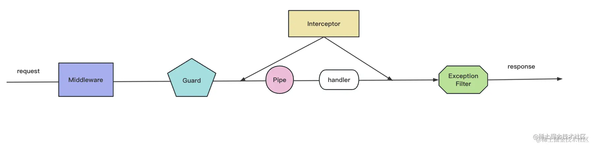

1. 读typeorm的文档，关注entity的写法，一对一/一对多/多对多的写法/entity Manager和Repository的区别
<https://www.typeorm.net/custom-repository>

2. 发送邮件验证码已加上。注意用env配置信息时，需要修改nest-cli.json，以及configModule模块需要全局引入后才能用

3. 需要再看一下vo是什么:
dto 是 data transfer object，用于参数的接收。
vo 是 view object，用于返回给视图的数据的封装。
而 entity 是和数据库表对应的实体类。

4. @Query是怎么用的
query 是 url 中 ? 后的字符串，需要做 url encode。
在 Nest 里，通过 @Query 装饰器来取

5. 再看一下interceptor那些

6. custom-exception.filter，format-response.interceptor,看一下，这两个为什么不处理fail/success的情况

7. ch115基本解决，没有添加完全部的文档因为看着实在是太乱了。目前有几个先这样。

8. Guard 是路由守卫的意思，可以用于在调用某个 Controller 之前判断权限，返回 true 或者 false 来决定是否放行。Guard的全局使用在app.module的providers里注入
Interceptor 是拦截器的意思，可以在目标 Controller 方法前后加入一些逻辑。next.handle() 就会调用目标 Controller，可以在之前和之后加入一些处理逻辑
Pipe 是管道的意思，用来对参数做一些检验和转换
ExceptionFilter 可以对抛出的异常做处理，返回对应的响应

9. 自定义装饰器 ch12:函数装饰器/类装饰器

10. register：用一次模块传一次配置，比如这次调用是 BbbModule.register({aaa:1})，下一次就是 BbbModule.register({aaa:2}) 了
forRoot：配置一次模块用多次，比如 XxxModule.forRoot({}) 一次，之后就一直用这个 Module，一般在 AppModule 里 import
forFeature：用了 forRoot 固定了整体模块，用于局部的时候，可能需要再传一些配置，比如用 forRoot 指定了数据库链接信息，再用 forFeature 指定某个模块访问哪个数据库和表。

11. ch62 动态读取不同环境的配置

12. 存在一个问题：数据库操作太机械了，尤其用1234来作为id很容易弄混。后面看是否有别的办法

13. 好...本地的docker镜像终于跑起来了！一个超级智障的问题是把镜像里mysql的连接也设置成了3007端口，这不是你的本地呀！默认是3006才对，改回3006就美美可以了，很不错！